# **Práctica: Kubernetes**

**Tabla de contenidos:**

- [**Práctica: Kubernetes**](#práctica-kubernetes)
  - [**¿Qué tienes que hacer?**](#qué-tienes-que-hacer)
  - [**Ejercicio 1: Despliegue en minikube**](#ejercicio-1-despliegue-en-minikube)
    - [**¿Qué tienes que entregar? (Ej1)**](#qué-tienes-que-entregar-ej1)
  - [**Ejercicio 2: Despliegue en otra distribución de kubernetes**](#ejercicio-2-despliegue-en-otra-distribución-de-kubernetes)
    - [**¿Qué tienes que entregar? (Ej2)**](#qué-tienes-que-entregar-ej2)
  - [**Realización**](#realización)
    - [**Ejercicio 1**](#ejercicio-1)
    - [**Ejercicio 2**](#ejercicio-2)

---

Link: [https://fp.josedomingo.org/sri2223/8_k8s/practica.html](https://fp.josedomingo.org/sri2223/8_k8s/practica.html)

---

## **¿Qué tienes que hacer?**

En IAW has creado dos imágenes de dos aplicaciones: bookmedik (php) y polls (python django). Elige una de ellas y despliégala en kubernetes. Para ello vamos a hacer dos ejercicios:

## **Ejercicio 1: Despliegue en minikube**

Escribe los ficheros yaml que te posibilitan desplegar la aplicación en minikube. Recuerda que la base de datos debe tener un volumen para hacerla persistente. Debes crear ficheros para los deployments, services, ingress, volúmenes...

Despliega la aplicación en minikube.

### **¿Qué tienes que entregar? (Ej1)**

1. Salida de los comando que nos posibilitan ver los recursos que has creado en el cluster.

2. Pantallazo accediendo a la aplicación utilizando el servicio.

3. Pantallazo accediendo a la aplicación utilizando el ingress.

4. Elimina el despliegue de la base datos, vuelve a crearla y comprueba que la aplicación no ha perdido los datos.

5. Escala la aplicación con 3 replicas. Muestra la salida oportuna para ver los pods que se han creado.

6. Modifica la aplicación, vuelve a crear una imagen con la nueva versión y actualiza el despliegue. No te olvide de anotar la modificación. Muestra la salida del historial de despliegue, la salida de `kubectl get all` y un pantallazo donde se vea la modificación que has realizado.

7. Entrega la url del repositorio donde están los ficheros yaml.

## **Ejercicio 2: Despliegue en otra distribución de kubernetes**

Instala un clúster de kubernetes (más de un nodo). Tienes distintas opciones para construir un cluster de kubernetes: [Alternativas para instalación simple de k8s](https://github.com/josedom24/curso_kubernetes_ies/blob/main/modulo2/alternativas.md).

Realiza el despliegue de la aplicación en el nuevo clúster. Es posible que no tenga instalado un ingress controller, por lo que no va a funcionar el ingress (puedes buscar como hacer la instalación: por ejemplo el [nginx controller](https://kubernetes.github.io/ingress-nginx/)).

Escala la aplicación y ejecuta `kubectl get pods -o wide` para ver cómo se ejecutan en los distintos nodos del clúster.

### **¿Qué tienes que entregar? (Ej2)**

1. Enseña al profesor la aplicación funcionando en el nuevo clúster.

---

## **Realización**

### **Ejercicio 1**

Como aplicación a desplegar usaré bookmedik, ya que es la que más me ha gustado de las dos.

Inicio MiniKube:

```bash
minikube start --driver=kvm2
```

Comienzo creando un *ConfigMap* y un *Secret* para la aplicación:

```bash
kubectl create configmap cm-prack8s --from-literal=mysql_usuario=bookmedik --from-literal=basededatos=bookmedik -o yaml --dry-run=client > cm-prack8s.yaml

kubectl create secret generic secret-prack8s --from-literal=mysql_password=bookmedik --from-literal=rootpass=root -o yaml --dry-run=client > secret-prack8s.yaml
```

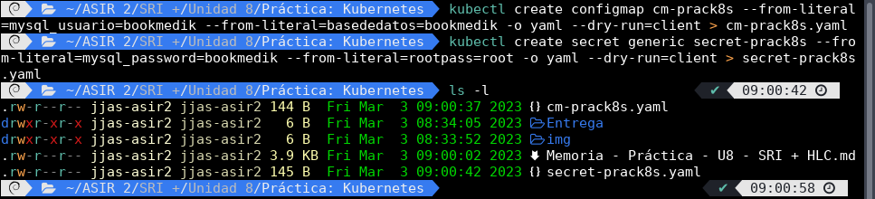

Volumen para MariaDB:

```bash
nano -cl pvc-mariadb-prack8s.yaml
```

```yaml
apiVersion: v1
kind: PersistentVolumeClaim
metadata:
  name: pvc-mariadb-prack8s
spec:
  accessModes:
    - ReadWriteOnce
  resources:
    requests:
      storage: 3Gi
```

Despliegue de MariaDB:

```bash
nano -cl deploy-mariadb-prack8s.yaml
```

```yaml
apiVersion: apps/v1
kind: Deployment
metadata:
  name: mariadb
  labels:
    app: mariadb
    tier: backend
spec:
  replicas: 1
  selector:
    matchLabels:
      app: mariadb
      tier: backend
  template:
    metadata:
      labels:
        app: mariadb
        tier: backend
    spec:
      volumes:
        - name: mariadb-data
          persistentVolumeClaim:
            claimName: pvc-mariadb-prack8s
      containers:
        - name: mariadb-prack8s
          image: mariadb:10.5
          env:
            - name: MARIADB_ROOT_PASSWORD
              valueFrom:
                secretKeyRef:
                  name: secret-prack8s
                  key: rootpass
            - name: MARIADB_DATABASE
              valueFrom:
                configMapKeyRef:
                  name: cm-prack8s
                  key: basededatos
            - name: MARIADB_USER
              valueFrom:
                configMapKeyRef:
                  name: cm-prack8s
                  key: mysql_usuario
            - name: MARIADB_PASSWORD
              valueFrom:
                secretKeyRef:
                  name: secret-prack8s
                  key: mysql_password
          ports:
            - name: mariadb-port
              containerPort: 3306
          volumeMounts:
            - mountPath: "/var/lib/mysql"
              name: mariadb-data
```

Servicio de MariaDB:

```bash
nano -cl svc-mariadb-prack8s.yaml
```

```yaml
apiVersion: v1
kind: Service
metadata:
  name: mariadb
  labels:
    app: mariadb
    tier: backend
spec:
  type: ClusterIP
  ports:
  - port: 3306
    targetPort: mariadb-port
  selector:
    app: mariadb
    tier: backend
```

Despliegue de Bookmedik:

```bash
nano -cl deploy-bookmedik-prack8s.yaml
```

```yaml
apiVersion: apps/v1
kind: Deployment
metadata:
  name: bookmedik
  labels:
    app: bookmedik
    tier: frontend
spec:
  replicas: 2
  selector:
    matchLabels:
      app: bookmedik
      tier: frontend
  template:
    metadata:
      labels:
        app: bookmedik
        tier: frontend
    spec:
      containers:
      - name: bookmedik-prack8s
        image: githubemail1asir/bookmedik:v1_2
        env:
          - name: USUARIO_BOOKMEDIK
            valueFrom:
              configMapKeyRef:
                name: cm-prack8s
                key: mysql_usuario
          - name: CONTRA_BOOKMEDIK
            valueFrom:
              secretKeyRef:
                name: secret-prack8s
                key: mysql_password
          - name: DATABASE_HOST
            value: mariadb
          - name: NOMBRE_DB
            valueFrom:
              configMapKeyRef:
                name: cm-prack8s
                key: basededatos
        ports:
          - name: bookmedik-port
            containerPort: 80
```

Servicio de Bookmedik:

```bash
nano -cl svc-bookmedik-prack8s.yaml
```

```yaml
apiVersion: v1
kind: Service
metadata:
  name: bookmedik
  labels:
    app: bookmedik
    tier: frontend
spec:
  type: NodePort
  ports:
  - port: 80
    targetPort: bookmedik-port
  selector:
    app: bookmedik
    tier: frontend
```

Tendríamos que tener creados también los dos ficheros que creamos antes con los comandos `kubectl create configmap` y `kubectl create secret`:

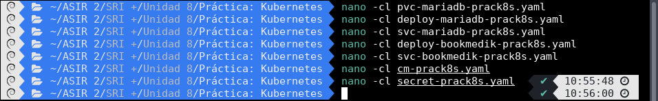

El ingress de Bookmedik lo crearé más tarde.

Despliego los recursos:

```bash
kubectl apply -f cm-prack8s.yaml

kubectl apply -f secret-prack8s.yaml

kubectl apply -f pvc-mariadb-prack8s.yaml

kubectl apply -f deploy-mariadb-prack8s.yaml

kubectl apply -f svc-mariadb-prack8s.yaml

kubectl apply -f deploy-bookmedik-prack8s.yaml

kubectl apply -f svc-bookmedik-prack8s.yaml
```

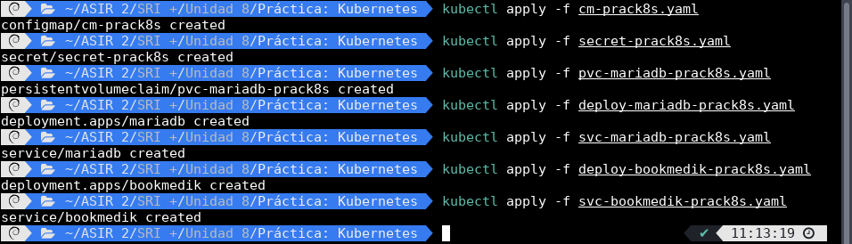

Los reviso con:

```bash
kubectl get cm,secret,pvc,pv,deploy,svc
```

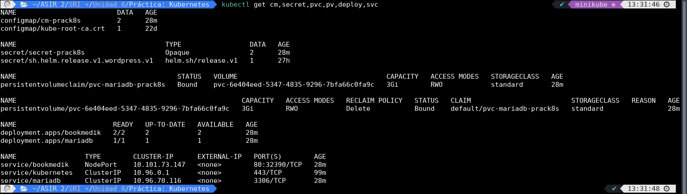

Anoto el deploy de la primera versión de Bookmedik:

```bash
kubectl annotate deployment.apps/bookmedik kubernetes.io/change-cause="Primer despliegue de Bookmedik"

kubectl rollout history deployment.apps/bookmedik

minikube ip
```

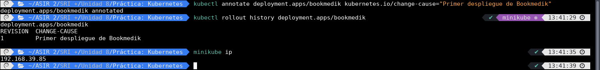

Accedo a la aplicación usando la IP de minikube y el puerto 32390 que me ha asignado el servicio de Bookmedik de tipo NodePort. Las credenciales serán *admin/admin*:

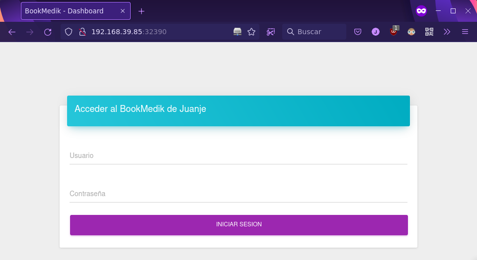

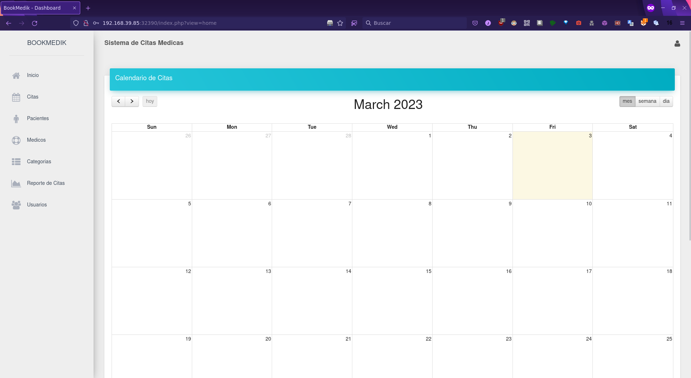

Sabiendo que ya funciona, creo el ingress para Bookmedik:

```bash
nano -cl ingress-bookmedik-prack8s.yaml
```

```yaml
apiVersion: networking.k8s.io/v1
kind: Ingress
metadata:
  name: ingress-bookmedik-prack8s
spec:
  rules:
  - host: bookmedik.prack8s.com
    http:
      paths:
      - path: /
        pathType: Prefix
        backend:
          service:
            name: bookmedik
            port:
              number: 80
```

Despliego el ingress:

```bash
kubectl apply -f ingress-bookmedik-prack8s.yaml
```

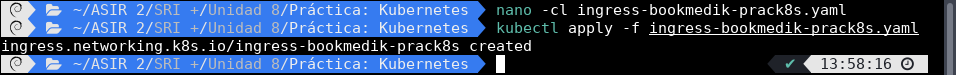

Edito el fichero `/etc/hosts` de mi máquina anfitriona para que resuelva el dominio `bookmedik.prack8s.com` a la IP de minikube:

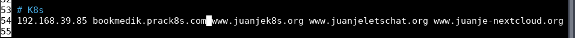

Y ahora ya puedo acceder a la aplicación desde el navegador usando el dominio:

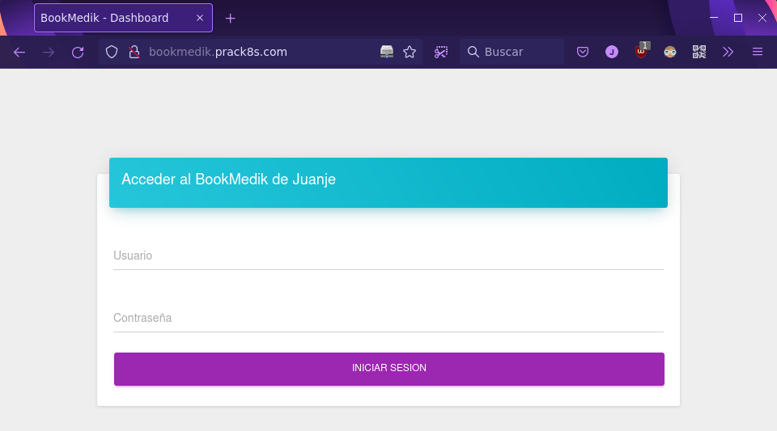

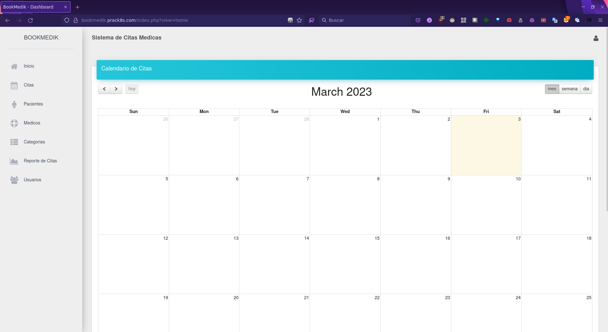

Ahora, creo un nuevo paciente para probar la permanencia de datos:


Borro el despliegue de la base de datos:

```bash
kubectl delete deployments.apps/mariadb
```


Y lo despliego de nuevo:

```bash
kubectl apply -f deploy-mariadb-prack8s.yaml
```

Si vuelvo a acceder a la sección de pacientes veré que el paciente creado anteriormente se mantiene por lo que la persistencia de datos funciona correctamente:

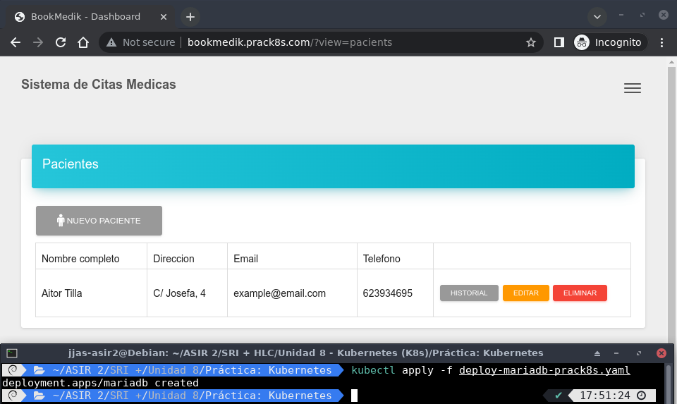

Escalo la aplicación de Bookmedik de 2 a 3 réplicas:

```bash
kubectl get pods

kubectl scale deployment.apps/bookmedik --replicas=3

kubectl get pods

kubectl get deployments
```

Y veo que se ha creado un nuevo pod:

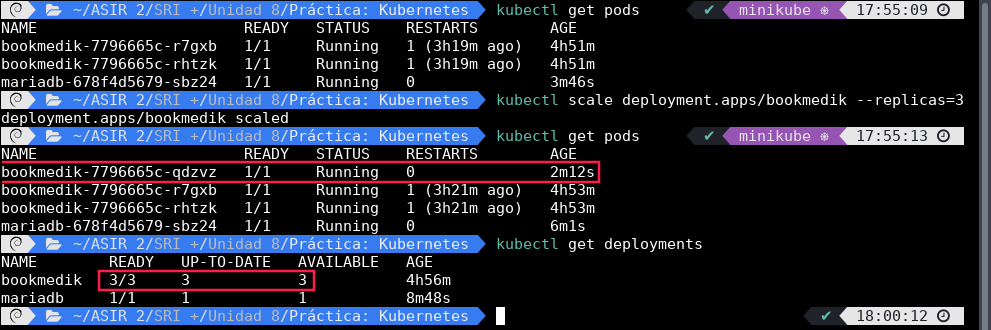

A continuación, modifico la aplicación de bookmedik. Lo que haré será cambiar el fichero *login-view.php* que contiene la vista de login de la aplicación, colocando el color verde en lugar del azul que había originalmente:

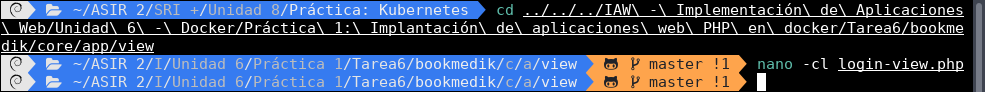

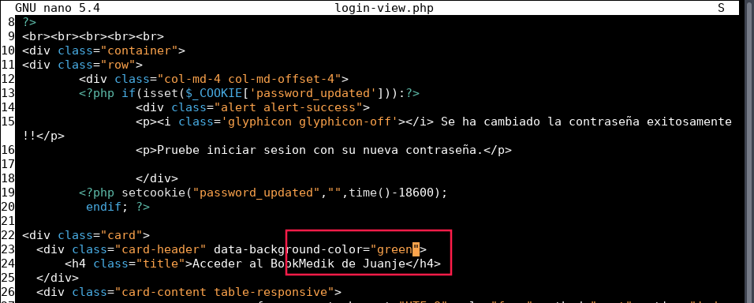

Construyo la nueva imagen con el cambio realizado:

```bash
docker build -t githubemail1asir/bookmedik:v1_3 .
```

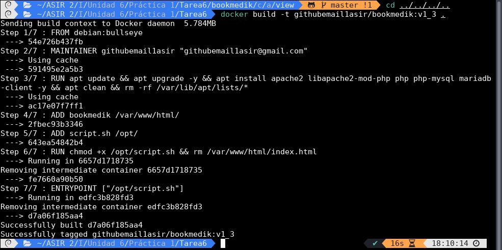

La subo a Docker Hub:

```bash
docker login

docker push githubemail1asir/bookmedik:v1_3
```

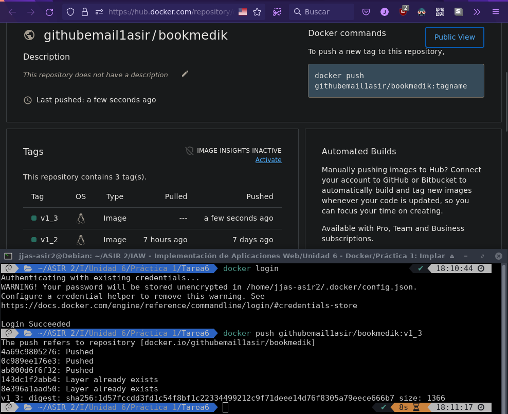

Modifico el fichero de despliegue de Bookmedik para que use la nueva versión de la imagen:

```bash
nano -cl deploy-bookmedik-prack8s.yaml
```


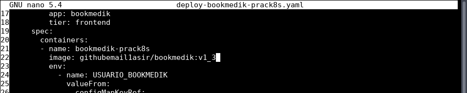

Despliego la nueva versión de la aplicación:

```bash
kubectl apply -f deploy-bookmedik-prack8s.yaml
```

Y lo anoto:

```bash
kubectl annotate deployment.apps/bookmedik kubernetes.io/change-cause="Segundo despliegue de Bookmedik"

kubectl rollout history deployment.apps/bookmedik
```

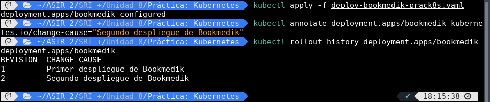

Si ahora accedo a la aplicación veré que el color de fondo de la página de login ha cambiado a verde:

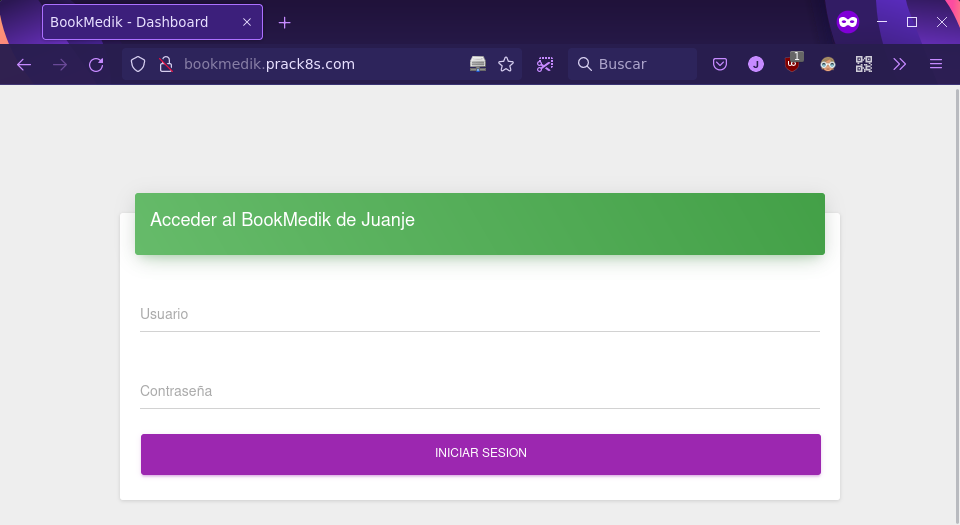

La salida de *kubectl get all*:

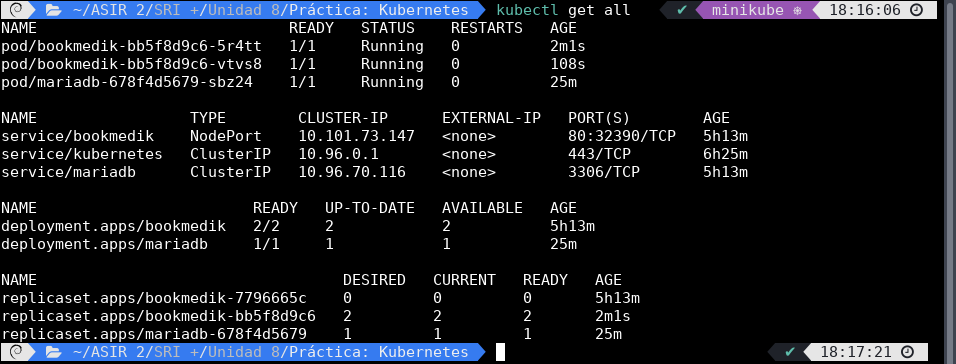

Podemos ver que ahora existen 2 *replicaset* de bookmedik en lugar de 1 como antes.

Los ficheros yaml los he subido a mi repositorio de GitHub: <https://github.com/JuanJesusAlejoSillero/SRI-HLC-Practica-Kubernetes>

### **Ejercicio 2**

Como clúster de Kubernetes usaré K3s. Lo he elegido ya que es una distribución de K8s ligera y preparada para entornos de producción por lo que considero que sería interesante aprender a usarla para futuros proyectos, ya sean personales o profesionales.

Lo primero que hago es crear las instancias que harán de nodos del clúster. Para ello he usado Vagrant con KVM, y *debian/bullseye64* como imagen. El fichero Vagrantfile es el siguiente:

```bash
mkdir k3s-vagrant

cd k3s-vagrant

nano -cl Vagrantfile
```

```ruby
# -*- mode: ruby -*-
# vi: set ft=ruby :

Vagrant.configure("2") do |config|
  config.vm.box = "debian/bullseye64"
  config.vm.box_check_update = false
  config.vm.synced_folder ".", "/vagrant", disabled: true
  config.vm.provider "libvirt" do |v|
    v.memory = 1024
    v.cpus = 1
  end
  config.vm.define "master" do |master|
    master.vm.hostname = "master"
    master.vm.network "private_network",
      :libvirt__network_name => "k3s-vagrant",
      :ip => "10.0.0.30",
      :libvirt__dhcp_enabled => false,
      :libvirt__forward_mode => "veryisolated"
  end
  config.vm.define "worker1" do |worker1|
    worker1.vm.hostname = "worker1"
    worker1.vm.network "private_network",
      :libvirt__network_name => "k3s-vagrant",
      :ip => "10.0.0.31",
      :libvirt__dhcp_enabled => false,
      :libvirt__forward_mode => "veryisolated"
  end
  config.vm.define "worker2" do |worker2|
    worker2.vm.hostname = "worker2"
    worker2.vm.network "private_network",
      :libvirt__network_name => "k3s-vagrant",
      :ip => "10.0.0.32",
      :libvirt__dhcp_enabled => false,
      :libvirt__forward_mode => "veryisolated"
  end
end
```

Y lo ejecuto:

```bash
vagrant up --provider=libvirt
```


Me conecto al nodo maestro e instalo k3s:

```bash
vagrant ssh master

sudo su -
```

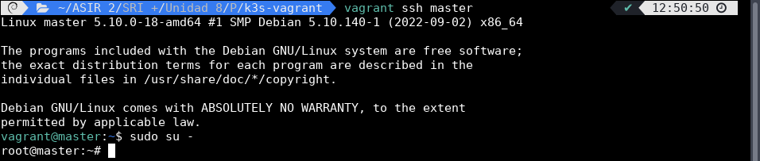

```bash
apt update

apt install curl -y

curl -sfL https://get.k3s.io | sh -
```

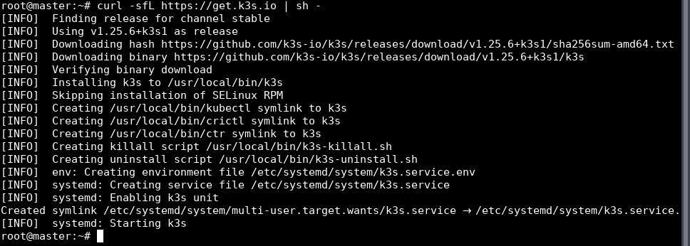

```bash
k3s kubectl get nodes
```


Obtengo el token de registro de los nodos:

```bash
cat /var/lib/rancher/k3s/server/node-token
```

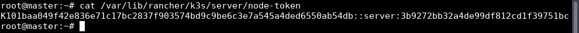

Ahora me conecto a los nodos worker1/2 e instalo k3s usando el token obtenido anteriormente y la IP del nodo master:

```bash
vagrant ssh worker1 / vagrant ssh worker2

sudo su -

apt update

apt install curl -y

curl -sfL https://get.k3s.io | K3S_URL=https://10.0.0.30:6443 K3S_TOKEN=K101baa049f42e836e71c17bc2837f903574bd9c9be6c3e7a545a4ded6550ab54db::server:3b9272bb32a4de99df812cd1f39751bc sh -
```

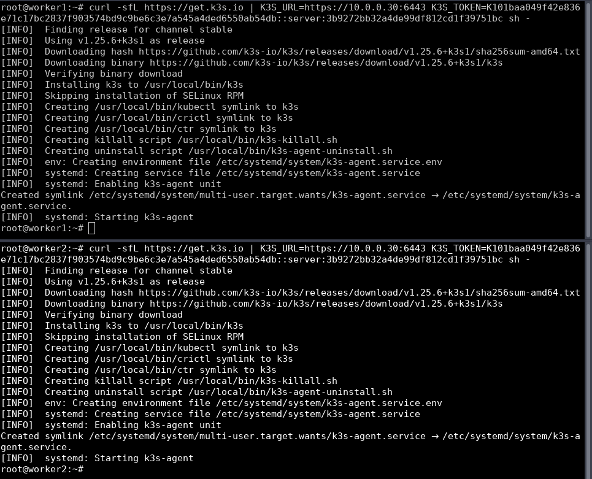

A continuación, me conecto al nodo master y compruebo que los nodos worker1/2 se han unido al clúster:

```bash
k3s kubectl get nodes
```

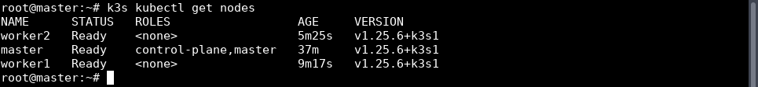

Instalo *git* y clono mi repositorio de GitHub:

```bash
apt install git -y

git clone https://github.com/JuanJesusAlejoSillero/SRI-HLC-Practica-Kubernetes.git
```

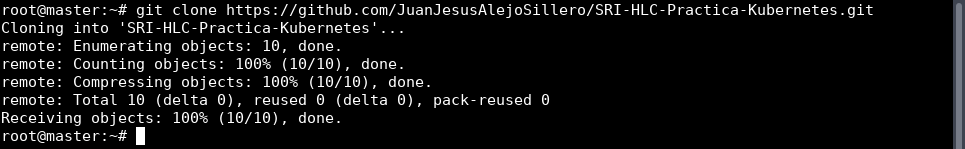

Cambio el dominio con el que accedo a la aplicación de Bookmedik en el fichero de despliegue:

```bash
nano -cl SRI-HLC-Practica-Kubernetes/ingress-bookmedik-prack8s.yaml
```

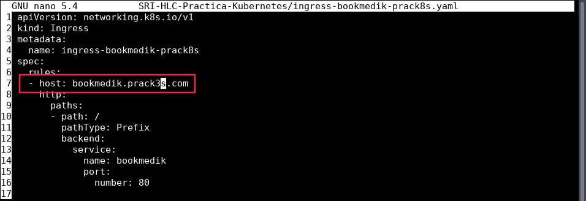

Creo los recursos de Kubernetes:

```bash
cd SRI-HLC-Practica-Kubernetes

k3s kubectl apply -f .

kubectl get cm,secret,pvc,pv,deploy,svc
```

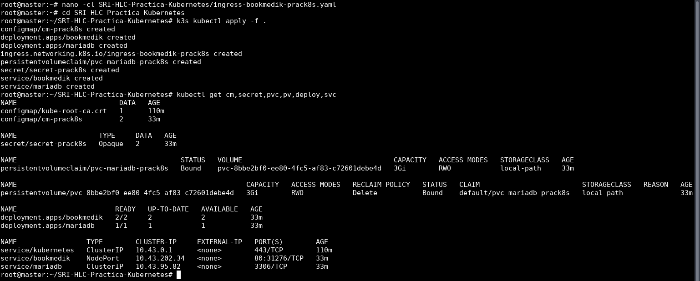

Edito el fichero `/etc/hosts` de mi máquina anfitriona para que resuelva el dominio `bookmedik.prack3s.com` a la IP de Vagrant del nodo master:

```bash
sudo nano -cl /etc/hosts
```

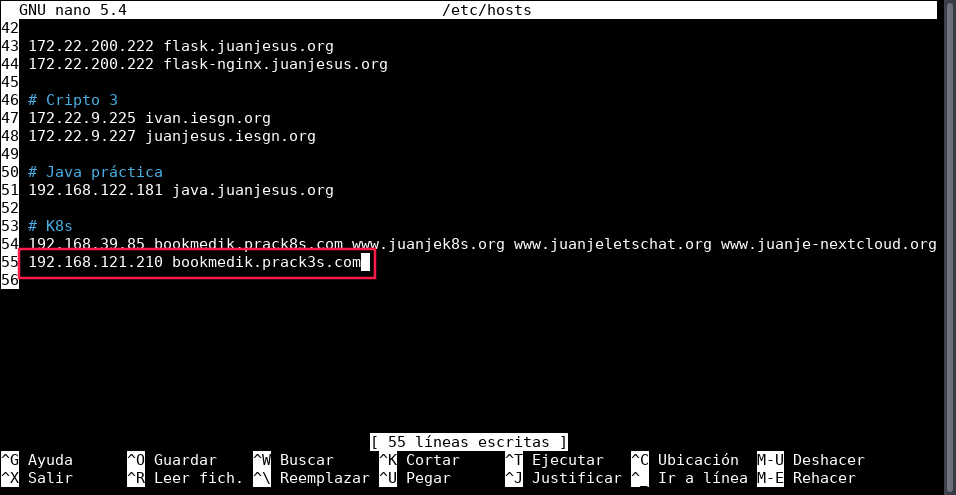

Accedo a la aplicación:

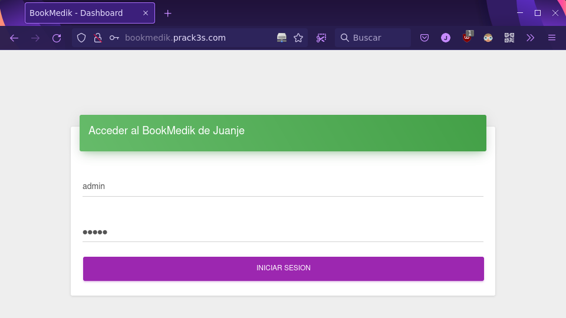

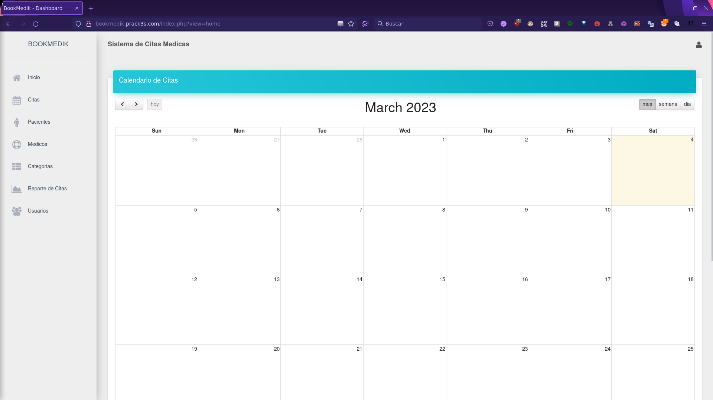

Para finalizar, escalo la aplicación a 3 pods:

```bash
k3s kubectl get pods,deployments -o wide

k3s kubectl scale deployment.apps/bookmedik --replicas=3

k3s kubectl get pods,deployments -o wide
```

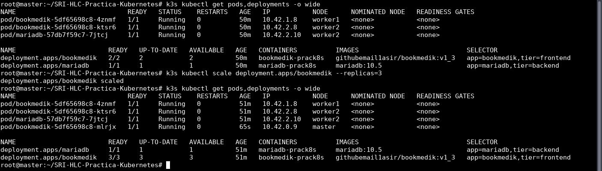

Podemos ver como se ha creado un nuevo pod de forma correcta y se ejecutan entre los diferentes nodos que forman el clúster.

---

✒️ **Documentación realizada por Juan Jesús Alejo Sillero.**
